# 📚 Library Management System - Admin Panel & User Portal

## 📌 Introduction
The Library Management System is a full-stack web application designed to streamline book and movie inventory, membership handling, and issue/return tracking for library administrators and users. Built using modern web technologies, it includes a powerful admin dashboard with role-based access and analytics.

## 🚀 Features

### 📘 Master Inventory Management
- Maintain categorized lists of **Books**, **Movies**, and **Memberships**.
- Add/Edit/Delete book and movie entries with serial numbers, categories, procurement details, and status.

### 👤 Membership Handling
- Manage member data including Aadhar verification, contact info, and active/inactive status.
- Track membership validity, pending fines, and history of borrow/return activities.

### 🔄 Issue/Return Tracking
- Admins can issue and return books/movies to/from members.
- Automatic fine calculation for overdue returns.
- Clear visual indicators for active issues, overdue items, and history logs.

### 🧾 Reports & Analytics
- Access summarized views like:
  - Active Issues
  - Overdue Returns
  - Fine Reports
  - Member Activity Logs

### 🔐 Role-based Access
- Admin and User login portals.
- Restricted admin-only panels for sensitive actions.

## 🛠 Tech Stack

- **Frontend**: ReactJS + Tailwind CSS + ShadCN UI
- **Backend**: Node.js + Express
- **Database**: MongoDB
- **Authentication**: JWT + Role-based auth

---

## 🧩 Core Modules

### 🔎 Master Lists
- **Books**: Name, Author, Category, Cost, Procurement Date, Status
- **Movies**: Name, Director, Category, Cost, Status
- **Memberships**: Name, Aadhar, Contact Info, Validity, Status, Fines

### 📊 Reports
- List of Active Issues
- List of Overdue Returns
- Fine Reports
- Issue Request Handling

---

## 📦 Installation & Setup

### 1️⃣ Clone the Repository
```bash
git clone https://github.com/your-username/library-management-system.git
cd library-management-system

### 3️⃣ Set Up Environment Variables
Create a `.env` file in the root directory and add the required API keys and credentials.

#### Example `.env` file:
```ini
PORT=3000
MONGO_URI=your-mongodb-connection-uri
JWT_SECRET=your-secret-key
```

### 4️⃣ Run the app Locally
```bash
npm run start
```

Access the admin panel and user portal at:
http://localhost:3000


## 🚀 Deployment
You can deploy the bot and admin panel using any cloud provider like AWS, Vercel, or Railway.

## 👨‍💻 Contributors
- **Aditya Singh** - Developer

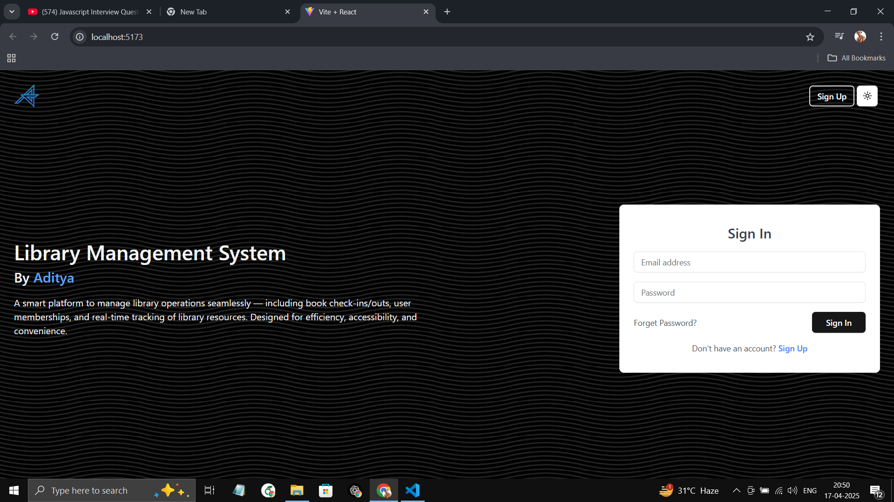<br><br>
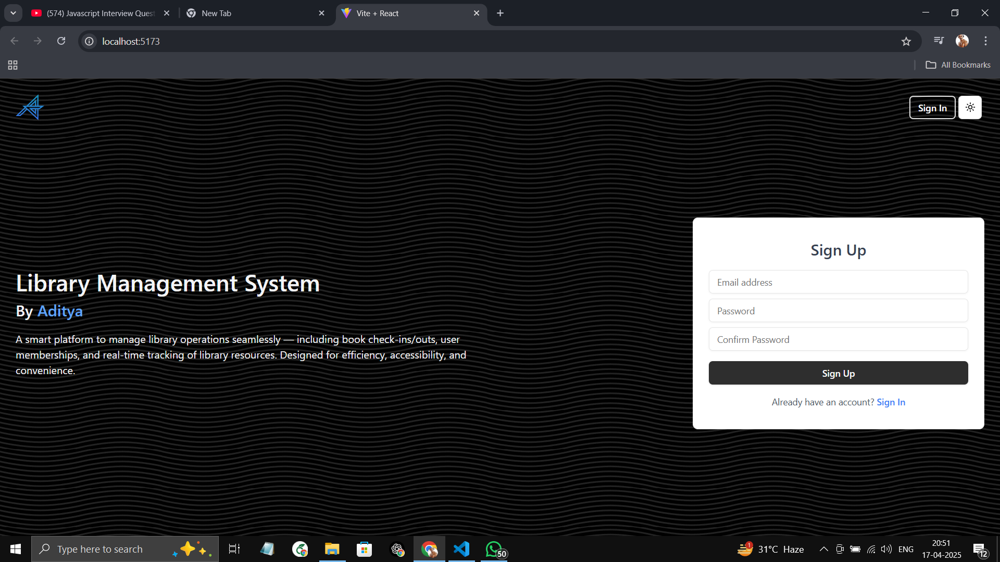<br><br>
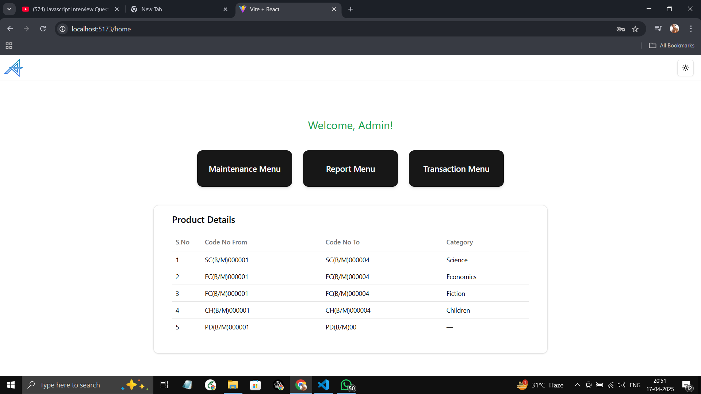<br><br>
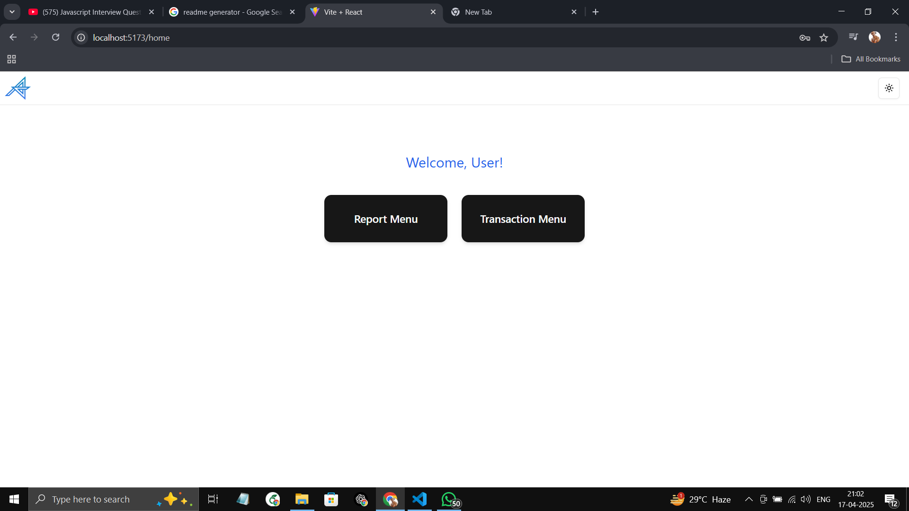<br><br>
<br><br>
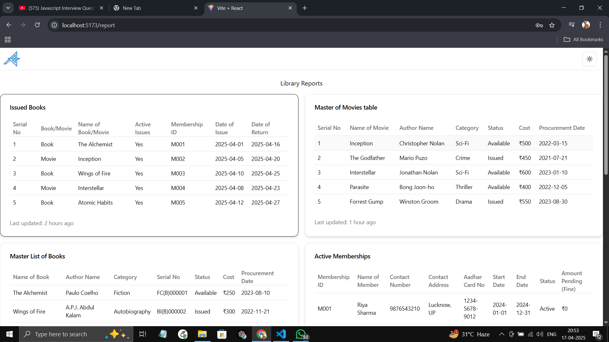<br><br>
<br><br>
<br><br>
<br><br>
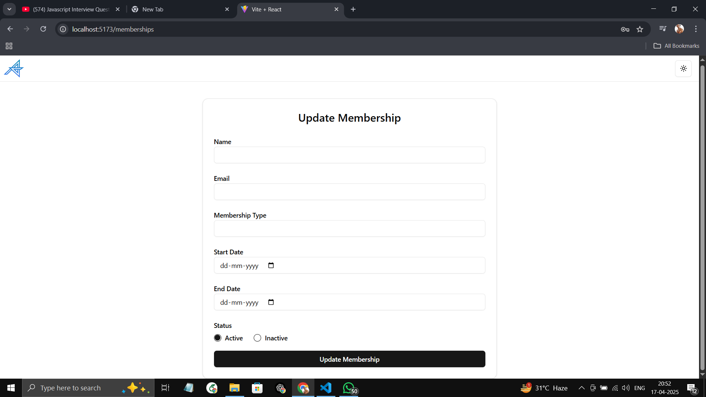<br><br>
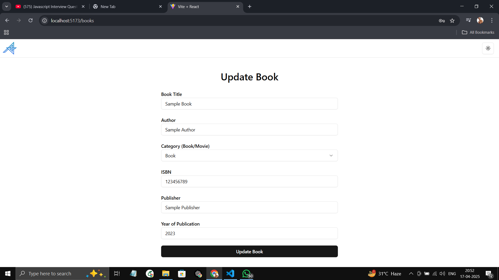<br><br>
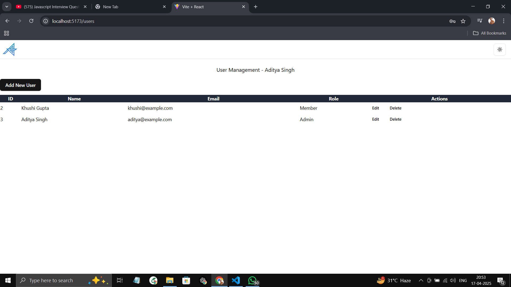<br><br>
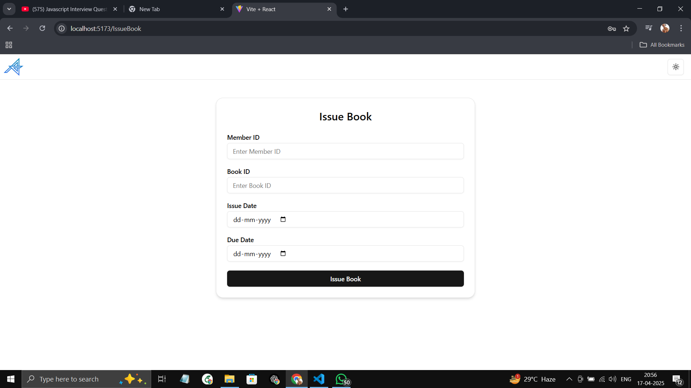<br><br>
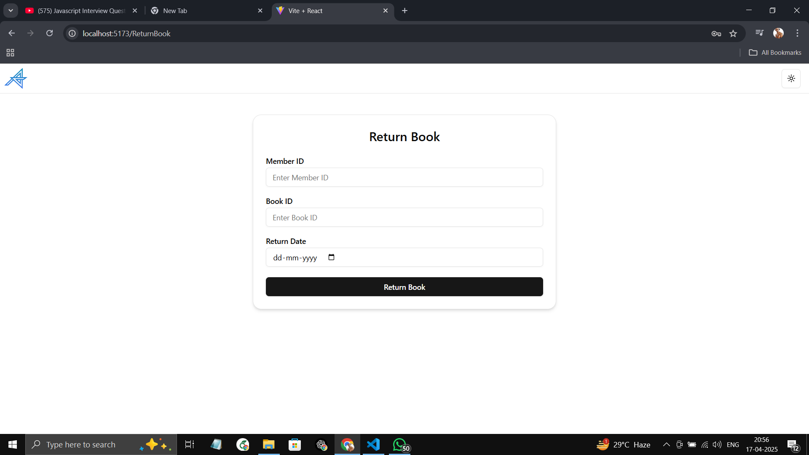<br><br>
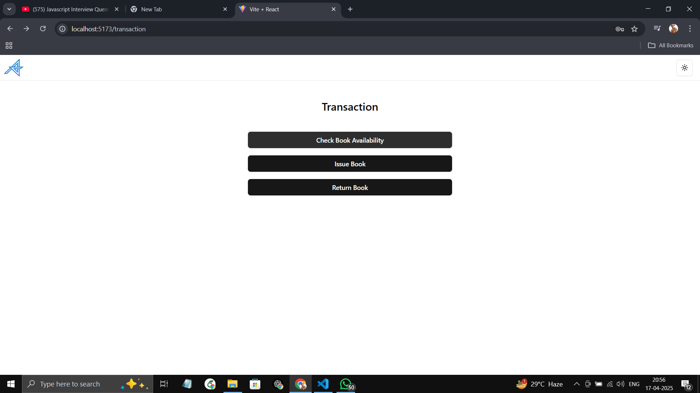<br><br>
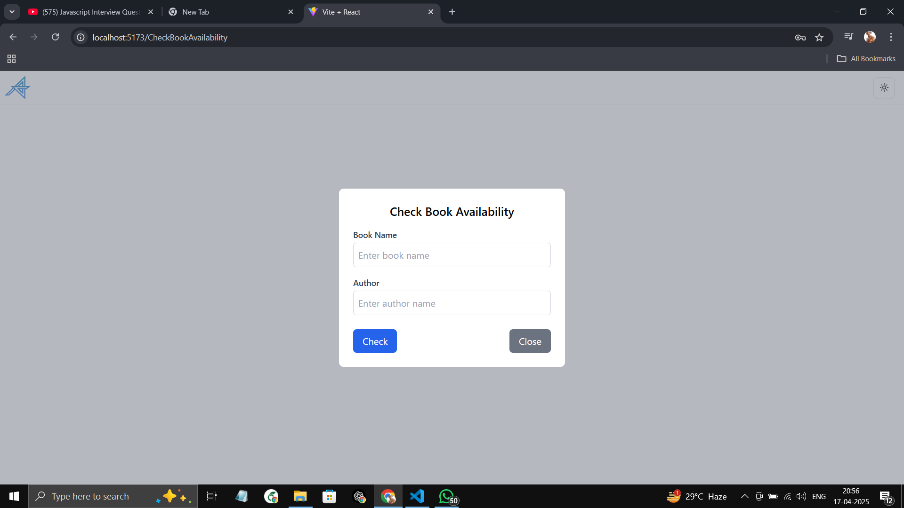<br><br>